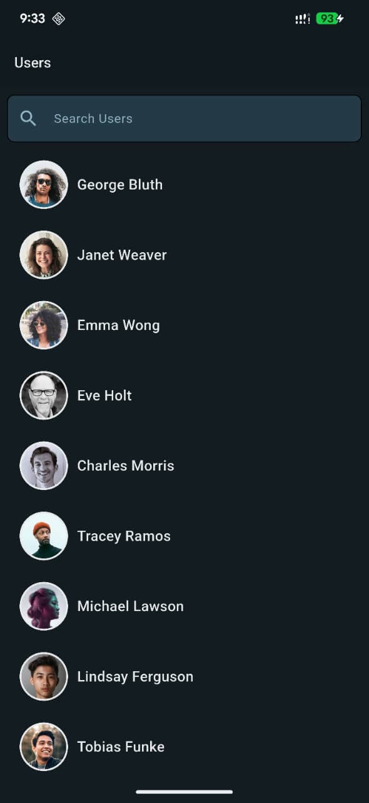
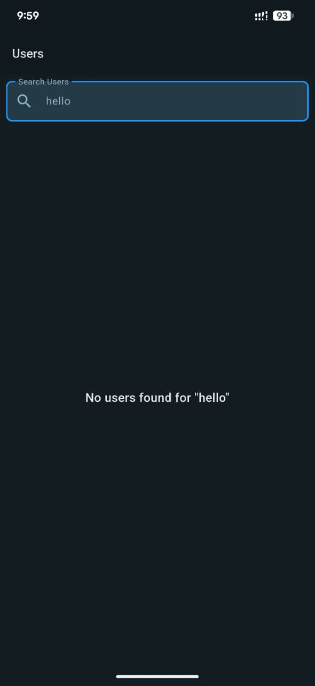
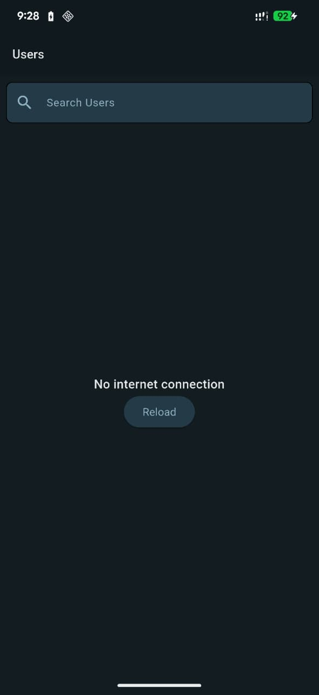

#  ReqRes User App

A Flutter application that displays user data from the [ReqRes API](https://reqres.in/).  
The app demonstrates clean architecture, MVVM design pattern, and Provider state management — focusing on scalability, performance, and code maintainability.

##  Features

-  **User List:** Fetch and display a list of users from the API
-  **Search Users:** Filter users locally by name
-  **User Details:** View complete user profile information
-  **Pagination:** Load additional users as you scroll
-  **Caching:** Cache user data and images for offline access
-  **Error Handling:** Manage network failures gracefully
-  **Empty Search State:** Display a friendly message when no results are found

---
------```Users```--------------```Profile```---------
      

------```Search```--------------```No User Found```--------
   
------```No Internet Connection```------



---

##  Architecture & Technologies

- **Architecture Pattern:** Clean Architecture
- **Design Pattern:** MVVM (Model–View–ViewModel)
- **State Management:** Provider
- **API Source:** [ReqRes.in](https://reqres.in/)
- **App Flavors:** Configured for multiple environments (Development, Staging, Production)

---


# Used Library Of This Project
1. [Provider](https://pub.dev/packages/provider) package for State management
2. [Get It](https://pub.dev/packages/get_it) package for Dependency Injection
3. [Dio](https://pub.dev/packages/dio) package for Network call
4. [Floor](https://pub.dev/packages/floor) package for Local Database

# Project Architecture
I used MVVM architectural pattern in this project.

### Directory Structure
The following is a high level overview of relevant files and folders.


```
.
├── app
│   ├── config
│   │   ├── route
│   │   │   └── app_route.dart
│   │   └── theme
│   │       └── light_theme.dart
│   ├── core
│   │   ├── constants
│   │   │   ├── app_text_data.dart
│   │   │   ├── colors.dart
│   │   │   └── constants.dart
│   │   ├── resources
│   │   │   └── data_state.dart
│   │   ├── usecase
│   │   │   └── usecase.dart
│   │   └── utils
│   │       └── error_handler.dart
│   ├── di_container.dart
│   ├── features
│   │   └── users
│   │       ├── data
│   │       │   ├── data_source
│   │       │   │   ├── local
│   │       │   │   │   ├── app_database.dart
│   │       │   │   │   ├── app_database.g.dart
│   │       │   │   │   ├── helper
│   │       │   │   │   │   ├── cache_response.dart
│   │       │   │   │   │   └── content_serialization.dart
│   │       │   │   │   └── user_dao.dart
│   │       │   │   └── remote
│   │       │   │       ├── chach_interceptor.dart
│   │       │   │       ├── dio_client.dart
│   │       │   │       └── exceptions
│   │       │   │           ├── api_exception.dart
│   │       │   │           ├── app_exception.dart
│   │       │   │           ├── base_api_exception.dart
│   │       │   │           ├── base_exception.dart
│   │       │   │           ├── json_format_exception.dart
│   │       │   │           ├── network_exception.dart
│   │       │   │           ├── no_internet_exception.dart
│   │       │   │           ├── not_found_exception.dart
│   │       │   │           ├── service_unavailable_exception.dart
│   │       │   │           ├── timeout_exception.dart
│   │       │   │           └── unauthorize_exception.dart
│   │       │   ├── model
│   │       │   │   ├── dio_cache.dart
│   │       │   │   ├── user_model.dart
│   │       │   │   └── user_response.dart
│   │       │   └── repository
│   │       │       └── user_repository_impl.dart
│   │       ├── domain
│   │       │   ├── entity
│   │       │   │   ├── dio_cache.dart
│   │       │   │   └── user.dart
│   │       │   ├── repository
│   │       │   │   └── user_repository.dart
│   │       │   └── usecase
│   │       │       └── get_users_usecase.dart
│   │       └── presentation
│   │           ├── pages
│   │           │   ├── details_user
│   │           │   │   └── details_user_screen.dart
│   │           │   └── fetch_users
│   │           │       ├── fetch_users_screen.dart
│   │           │       └── widgets
│   │           │           ├── all_users_widgets.dart
│   │           │           ├── data_not_found_widget.dart
│   │           │           └── search_widget.dart
│   │           ├── provider
│   │           │   └── user_provider.dart
│   │           └── widgets
│   │               ├── circular_image.dart
│   │               ├── custom_image.dart
│   │               ├── loader.dart
│   │               ├── rectangle_image.dart
│   │               └── text_style.dart
│   └── my_app.dart
├── flavors
│            ├── build_config.dart
│   ├── env_config.dart
│   └── environment.dart
├── main_dev.dart
├── main_prod.dart

```